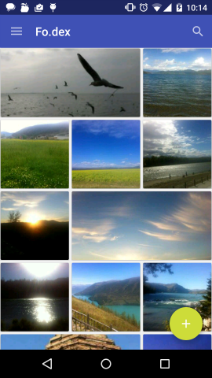
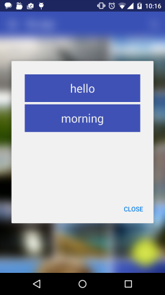

##Fo.dex

An Android client application allows you to index your photos.

##Download

##How to install
	git clone https://github.com/dyhpoon/Fo.dex.git
	cd Fo.dex/
	git submodule update --init
	// import project with Android Studio ...

##Facebook page
[Fodex Facebook Page](https://www.facebook.com/pages/Fodex/733509560068437)

##More Screenshots

##Thanks
* [FloatingActionButton](https://github.com/makovkastar/FloatingActionButton)
* [Glide](https://github.com/bumptech/glide)
* [CircularFloatingActionMenu](https://github.com/oguzbilgener/CircularFloatingActionMenu)
* [CircleImageView](https://github.com/hdodenhof/CircleImageView)
* [Stetho](https://github.com/facebook/stetho)
* [BlurDialogFragment](https://github.com/tvbarthel/BlurDialogFragment)
* [AndroidSwipeLayout](https://github.com/daimajia/AndroidSwipeLayout)
* [AndroidViewAnimations](https://github.com/daimajia/AndroidViewAnimations)
* [MaterialEditText](https://github.com/rengwuxian/MaterialEditText)
* [android-Ultra-Pull-To-Refresh](https://github.com/liaohuqiu/android-Ultra-Pull-To-Refresh)
* [AsymmetricGridView](https://github.com/felipecsl/AsymmetricGridView)
* [AARLinkSources](https://github.com/xujiaao/AARLinkSources)
* [Dagger](https://github.com/square/dagger)
* [android-Ultra-Pull-To-Refresh](https://github.com/liaohuqiu/android-Ultra-Pull-To-Refresh)
* [TouchImageView](https://github.com/MikeOrtiz/TouchImageView)

##Contributors
* [tomlui1019](https://github.com/tomlui1019)
* [mankatcheung](https://github.com/mankatcheung)

##License
    Copyright 2015 Darren Poon. All rights reserved.

    Licensed under the Apache License, Version 2.0 (the "License");
    you may not use this file except in compliance with the License.
    You may obtain a copy of the License at

        http://www.apache.org/licenses/LICENSE-2.0

    Unless required by applicable law or agreed to in writing, software
    distributed under the License is distributed on an "AS IS" BASIS,
    WITHOUT WARRANTIES OR CONDITIONS OF ANY KIND, either express or implied.
    See the License for the specific language governing permissions and
    limitations under the License.